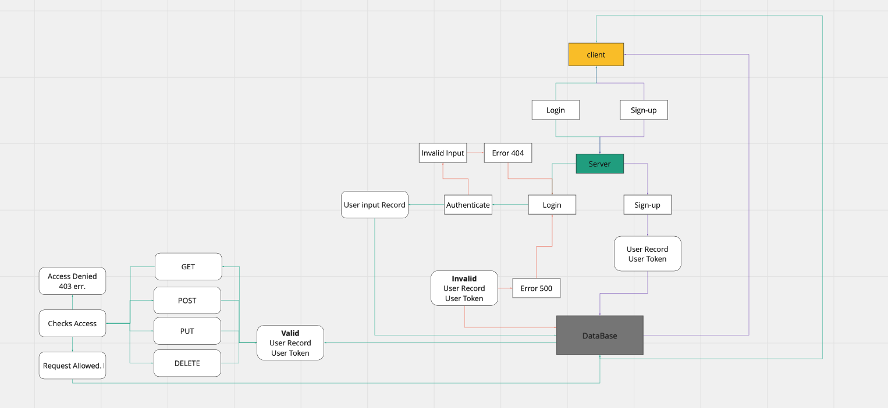

# auth-api

Access Control
Created by Jacob Gregor

## Installation\

npm install\

"dependencies": {
"base-64": "^1.0.0",
"bcrypt": "^5.0.0",
"cors": "^2.8.5",
"dotenv": "^8.2.0",
"express": "^4.17.1",
"jest": "^26.6.3",
"jsonwebtoken": "^8.5.1",
"morgan": "^1.10.0",
"pg": "^8.6.0",
"sequelize": "^6.6.2",
"sequelize-cli": "^6.2.0",
"sqlite3": "^5.0.2",
"supertest": "^6.1.3"
},\

.env{
PORT=3000
NODE_ENV=test
SECRET=test
}

## Business Requirements

Refer to the Authentication System Overview for a complete review of the application, including Business and Technical requirements along with the development roadmap.\

## Summary of Problem Domain\

## lab-08: Technical Requirements / Notes

In this final phase, the new requirement is to extend the restrictive capabilities of our routes to our API, implementing a fully functional, authenticated and authorized API Server using the latest coding techniques\

Specifically, we want to make the following restrictions:\

Regular users can READ\
Writers can READ and CREATE\
Editors can READ, CREATE, and UPDATE\
Administrators can READ, CREATE, UPDATE, and DELETE\
Routes that end up performing those actions in our API/Database need to be protected by both a valid user and that user’s permissions\

## Task 1: Combine these 2 servers into a single server\

Your server should respond to the following routes:\
POST /signup to create a user\
POST /signin to login a user and receive a token\
GET /secret should require a valid bearer token\
GET /users should require a valid token and “delete” permissions\
NOTE: You will have some duplicated files and functionality between the 2 servers. Eliminate the waste and end with a single running server with all current routes functional\

## Task 2: Create a new set of “Protected” API routes\

Restrict access without a valid token AND a specific capability.\

Create a new set of routes (V2) within the server\
V2 API Routes (/api/v2/...) must now be protected with the proper permissions based on user capability, using Bearer Authentication and an ACL\
`app.get(...)` should require authentication only, no specific roles\
`app.post(...)` should require both a bearer token and the create capability\
`app.put(...)` should require both a bearer token and the update capability\
`app.patch(...) `should require both a bearer token and the update capability\
`app.delete(...)` should require both a bearer token and the delete capability\

## Links to application deployment\

Heroku: https://auth-api-jacob.herokuapp.com
GitHub: https://github.com/Code-Fellows-401/auth-api
GitHub PR: https://github.com/Code-Fellows-401/auth-api/pulls?q=is%3Apr+is%3Aclosed

## Embedded UML\

WhiteBaord for Lab-04:
\

## Routes Used\

Path: /signup
responds with an { Object } with a key: value pair as follows -> {name: 'Name Here'}.\
HTTP GET

authRouter.post('/signup', async (req, res, next) => {
try {
let userRecord = await users.create(req.body);
const output = {
user: userRecord,
token: userRecord.token,
};
res.status(201).json(output);
} catch (e) {
next(e.message);
}
});

Path: /signin
Verifies User information with a given Username & PAssword, fetches said information and validated its authenticity. Returns user information if(valid), else throws errors.

authRouter.post('/signin', basicAuth, (req, res, next) => {
let user = {
user: req.user,
token: req.user.token,
};
res.status(200).json(user);
});

Path: /users
Fetches All user data and Maps(users) from our database.

authRouter.get('/users', bearerAuth, async (req, res, next) => {
const user = await users.findAll({});
const list = user.map((user) => user.username);
console.log(list);
res.status(200).json(list);
});

Path: /secret
Secret Area redirect

authRouter.get('/secret', bearerAuth, async (req, res, next) => {
res.status(200).send('Welcome to the secret area!');
});

## Route: /clothes

Path: /clothes responds with all { Object } with a key: value pair as follows -> {name: 'Name Here', city: 'Name Here'}.
HTTP GET

Path: /clothes:id responds with a specific { Object } based on the input Id with a key: value pair as follows -> {name: 'Name Here', city: 'Name Here'}.
HTTP GET

Path: /clothes Creates an specific { Object } based on the input model with a key: value pair as follows -> {name: 'Name Here', city: 'Name Here'}.
HTTP POST

Path: /clothes:id Updates a specific { Object } based on the id reference and the input model with a key: value pair as follows -> {name: 'Name Here', city: 'Name Here'}.
HTTP PUT

Path: /clothes:id Deletes a specific { Object } based on the id reference.
HTTP DELETE

Route: /food

Path: /food responds with all { Object } with a key: value pair as follows -> {name: 'Name Here', position: 'Name Here'}.
HTTP GET

Path: /food:id responds with a specific { Object } based on the input Id with a key: value pair as follows -> {name: 'Name Here', position: 'Name Here'}.
HTTP GET

Path: /food Creates an specific { Object } based on the input model with a key: value pair as follows -> {name: 'Name Here', position: 'Name Here'}.
HTTP POST

Path: /food:id Updates a specific { Object } based on the id reference and the input model with a key: value pair as follows -> {name: 'Name Here', position: 'Name Here'}.
HTTP PUT

Path: /food:id Deletes a specific { Object } based on the id reference.
HTTP DELETE
